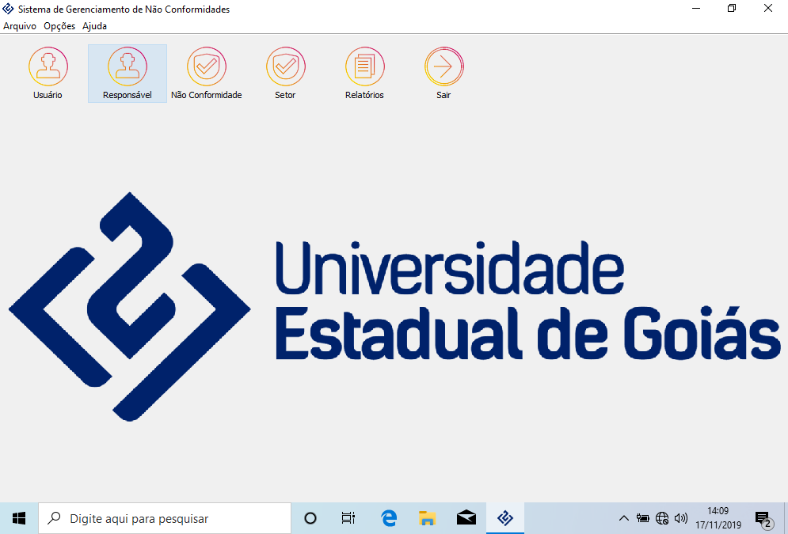
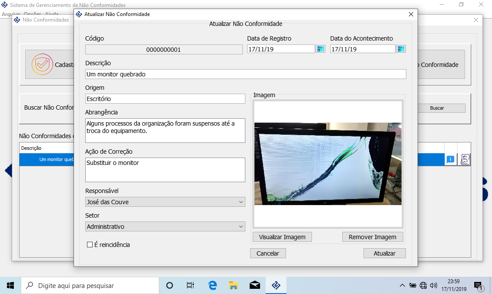
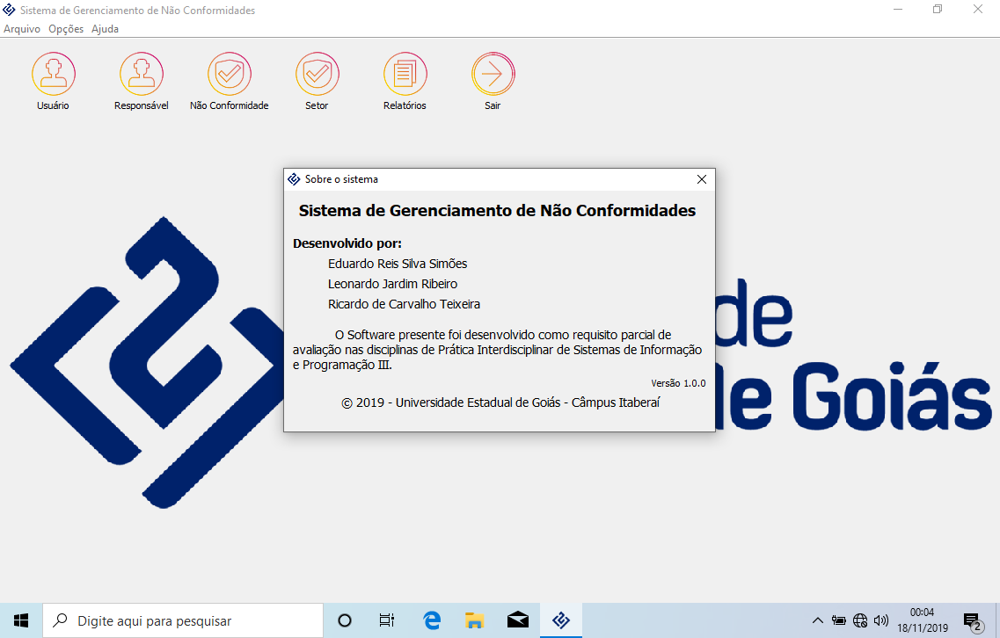

# NaoConformidade
Programa desenvolvido em Java e SQLite com persistência de dados no padrão Data Access Object de registros de não conformidades.
Este projeto foi desenvolvido como requisito parcial de avaliação nas disciplinas de Prática Interdisciplinar de Sistemas de Informação e Programação III. Sendo finalizado em novembro de 2019.

## Imagens
### Tela principal

### Atualização de não conformidade 

### Tela de sobre

